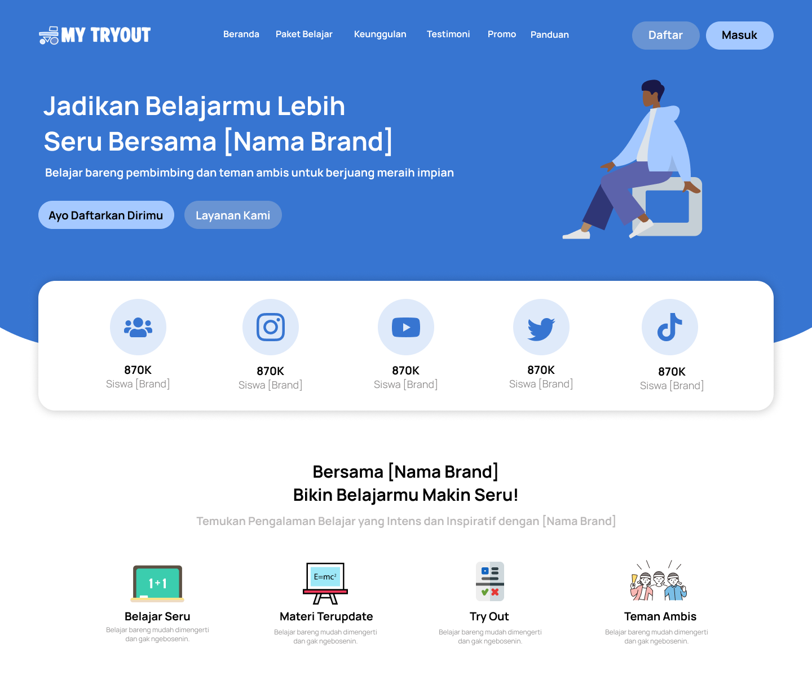
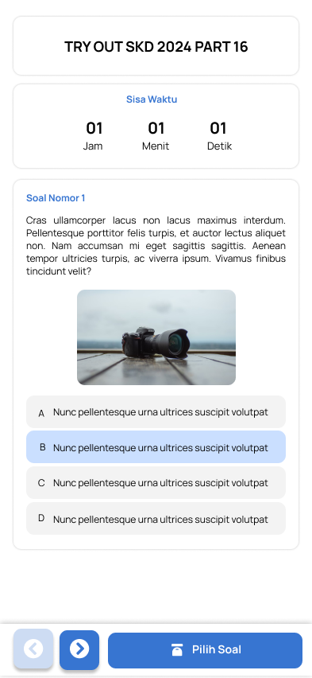

# MyTryout 🎯

🚧 **Status:** Masih dalam tahap desain di Figma 🎨 

Aplikasi **MyTryout** adalah platform berbasis web dan mobile untuk tryout dan menguji kemampuan kamu. Stay tuned! 🚀  

## 🎨 Desain Figma  
- [Desain Figma](https://www.figma.com/proto/iwp6SGMFLP85hrCson4xmA/TryOut?node-id=2-497&starting-point-node-id=2%3A497)

## 📷 Tampilan Aplikasi  
### 💻 Tampilan Desktop

  
  

### 📱 Tampilan Mobile

  
  

